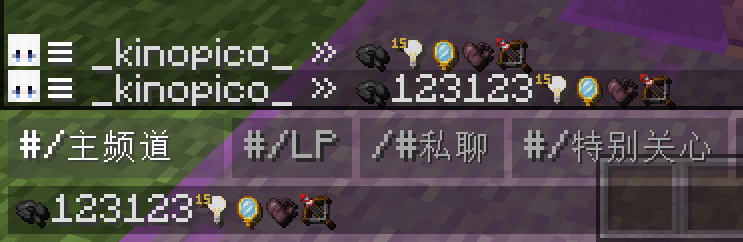

# FontJsonGenerator
简化Minecraft中字体Json配置的创建

# 使用
```Bash
dotnet run -c Release --input <配置文件地址>
```

或

```Bash
dotnet build -c Release
cd bin/Release/net6.0
./FontJsonGenerator --input <配置文件地址>
```

如果要输出结果到文件，可以在后面添加`--output <目标地址>`

例如：
1. 通过`dotnet run -c Release --input examplesettings.json --output <目标资源包的assets/minecraft/font/default.json地址>`生成Json文件
2. 在游戏内加载/重载资源包
3. 在游戏内输入一些资源包范围内的字体（examplesettings中是U+E300~U+E471）
4. 查看生成结果！ 

## 生成glyph
要生成glyph图，您需要在配置文件中添加"glyph"选项:
```json5
"glyph":
{
    "enabled": true, //是否启用此功能
    "tileSize": 16, //每个贴图的大小，最终大小将会使tileSize * 16
    "from": 0, //起始Unicode字符编号(10进制)
    "to": 65536, //结束Unicode字符编号(10进制)
    "pack_path": "/path/to/resourcepackRoot", //资源包地址，必须包含所有"range"中出现的纹理
    "fallback": "namespace:path/to/fallback/texture.png" //后备纹理地址
}
```
添加后的配置文件应该是如下结构：
```json5
{
  "name": "fontname",
  "starts": "<起始Unicode位置>",
  "ranges": 
  [
    ///...
  ],
  "glyph":
  {
    //...
  }
}
```
生成的glyph将位于当前运行目录下